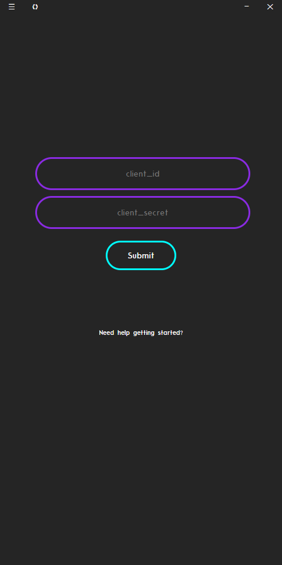
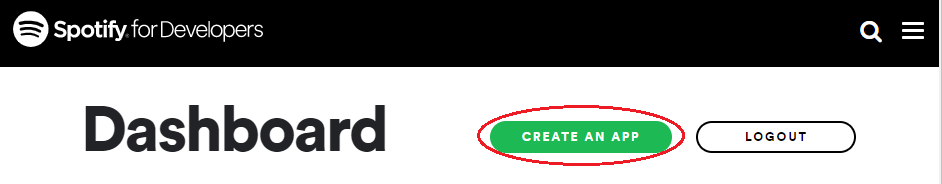
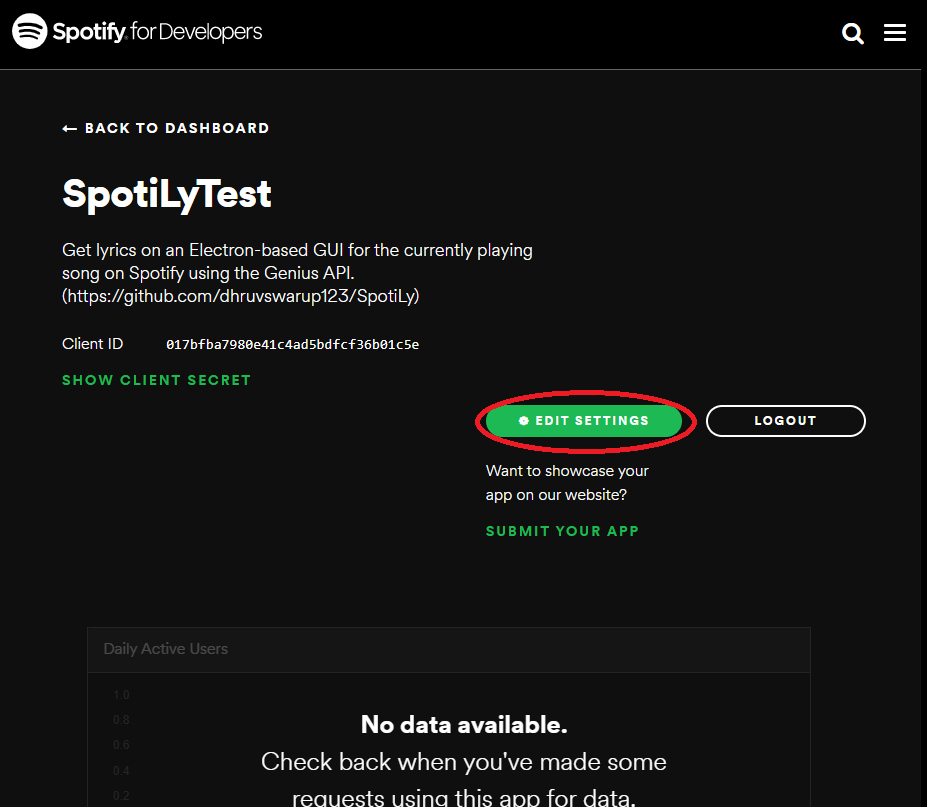
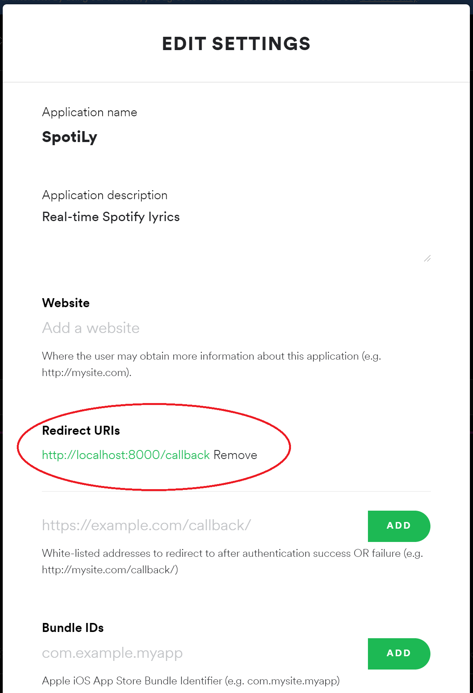
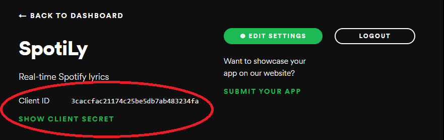
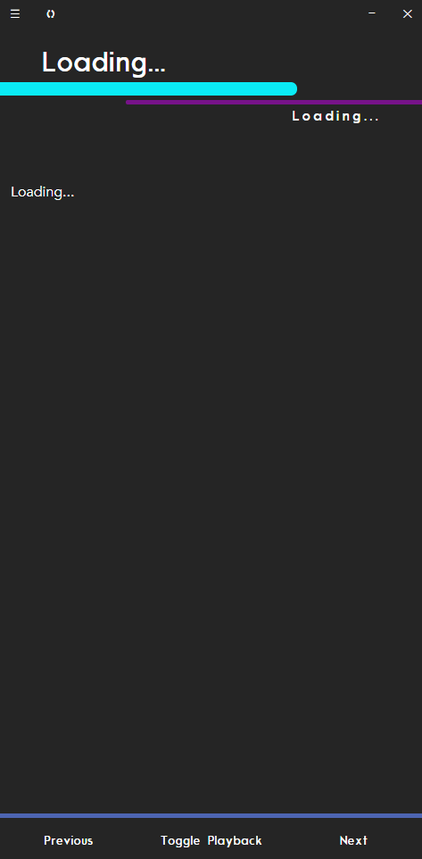
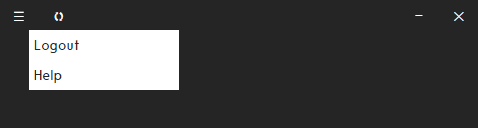

<a name="top"></a>
# SpotiLy
Get lyrics on an Electron-based GUI for the currently playing song on Spotify using the Genius API.

## Contents
1. [ Downloads ](#download)
2. [ Command Line Setup ](#cls)
3. [ Getting Started ](#starting)
   1. [ How to Use? ](#usage) 
   2. [ Getting Client ID and Client Secret ](#client)
   3. [ Troubleshooting ](#trouble)
4. [ Scope for Improvement ](#improvement)
5. [ Author ](#author)


<a name="download"></a> 
## Downloads [&#8679;](#top)
The app is available to download on Windows.

Download the installers from here:
1. [Windows](https://drive.google.com/file/d/1wpN5bZ-9C2sd6shu9DUtnXUxGfiExJv3/view?usp=sharing)
2. MacOS - coming soon
3. Linux - coming soon

<a name="cls"></a>
## Command Line Setup [&#8679;](#top)

To run the app from the command line, [npm must be installed](https://www.npmjs.com/get-npm)
```
$ git clone https://github.com/dhruvswarup123/SpotiLy.git
$ cd SpotiLy
$ npm install 
$ npm start
```

To build an executable, run the following command. 

```
$ npm run make
```
*Note: This will create an executable that is specific to the OS that the command is run on. See [electron-forge](https://www.electronforge.io/) for more info* 

<a name="starting"></a>
## Getting Started [&#8679;](#top)
This section explains how to start and use the app, including how to obtain the *client ID* and the *client secret* values needed to login to Spotify's API.

<a name="usage"></a>
### a. How to Use? [&#8679;](#top)

1. On starting the app, the user will be prompted to enter the client_id and client_secret values. (See [this](#client))
<p align="center"></p>

2. The user will now be redirected to the spotify login page.
3. The app will now automatically load lyrics and display them, obviously, given that a song is indeed playing.
4. The song control buttons can be used to change tracks.

<a name="client"></a>
### b. Getting Client ID and Client Secret [&#8679;](#top)
The Spotify API requires the use of a *client ID* and a *client secret* to verify the app. Because I am a poor college student, I did not have money to spend on a server😐. So, here we are. This is, however, a one-time deal. Once these have been loaded into the app, it will not have to be done again.

1. Open the [Spotify Developer Dashboard](https://developer.spotify.com/dashboard/)
2. Log in with a spotify account.
3. Click the "create an app" button.
<p align="center"></p>

4. The app name and description can be filled as desired, but this is what I recommend: 
   1. App Name: "SpotiLy"
   2. App Description: "Get lyrics on an Electron-based GUI for the currently playing song on Spotify using the Genius API. (https://github.com/dhruvswarup123/SpotiLy)"
5. Click "Create"
6. In the app page, click on "edit settings".
<p align="center"></p>

7. In the section marked "Redirect URIs", paste `http://localhost:8000/callback`, and click add.
<p align="center"></p>

8. Click "Save"
9.  Now copy and paste the client ID, and the client secret (after clicking "show client secret") into the app.
<p align="center"></p>

<a name="trouble"></a>
### c. Troubleshooting [&#8679;](#top)
 If the wrong values for client id or client secret are entered, the loading page will be stuck as shown. To re-enter the values, select "logout" from the hamburger menu.

<p align="center"></p>
<br>
<p align="center"></p>

<a name="improvement"></a>
## Scope for Improvement [&#8679;](#top)
(This section includes known bugs in the program)
1. Adding synced lyrics
   1. This involves purchasing a plan from MusixMatch for access to the database with the timestamped lyrics
2. Hamburger Menu
   1. Add open on hover
   2. Close menu on clicking any div outside the menu. 


<a name="author"></a>
## Author [&#8679;](#top)

<div align="center">


### Dhruv Swarup
[Github](https://github.com/dhruvswarup123) <br>
[LinkedIn](https://www.linkedin.com/in/dhruv-s-b25727135/)

</div>